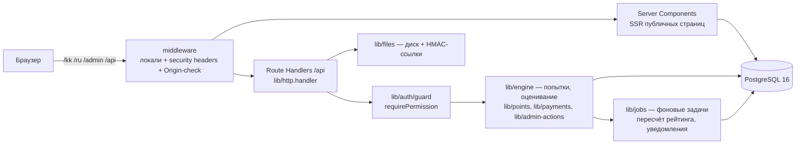

# Архитектура

## Обзор

Один экземпляр Next.js 16 (App Router) обслуживает и публичный сайт, и админку,
и REST API. PostgreSQL 16 — единственное хранилище состояния (данные, сессии,
rate-limit, очередь уведомлений); файлы — на диске за подписанными ссылками.
Причины отказа от monorepo/NestJS/Redis/MinIO — в [decisions.md](decisions.md)
(D-001…D-003): меньше движущихся частей при тех же контрактах, каждая точка
расширения закрыта интерфейсом (`SmsProvider`, `PaymentProvider`, `lib/jobs.ts`,
`lib/files.ts`), поэтому переход на выделенные сервисы не трогает бизнес-код.

## Слои

| Слой | Где | Правило |
|---|---|---|
| Маршруты API | `app/api/**/route.ts` | только парсинг (zod strict), guard, вызов lib, `ok()/err` |
| Домен | `lib/engine/*`, `lib/points.ts`, `lib/payments.ts`, `lib/admin-actions.ts` | вся бизнес-логика; транзакции и идемпотентность здесь |
| Инфраструктура | `lib/db.ts`, `lib/http.ts`, `lib/ratelimit.ts`, `lib/audit.ts`, `lib/jobs.ts`, `lib/files.ts`, `lib/notify.ts` | без бизнес-правил |
| UI | `app/(site)/[locale]` и `app/(admin)/admin` | два корневых layout'а (разные `lang`); публичные страницы — SSR с `revalidate`, админка — клиентские таблицы поверх `/api/admin` |

## Поток запроса (API)

1. `middleware.ts` — редирект на локаль, security-заголовки (CSP и др.), для
   мутаций `/api` — проверка Origin (анти-CSRF при cookie-аутентификации).
2. `handler()` из `lib/http.ts` — единый catch: `ApiError`/`ZodError` → JSON
   `{error}`; всё остальное → 500 без утечки деталей.
3. `requirePermission()` — сессия из httpOnly cookie (`bh_access` 15 мин,
   `bh_refresh` 30 дней с одноразовой ротацией; повторное использование
   refresh-токена отзывает все сессии пользователя).
4. `parseBody(req, Schema)` — zod-схемы со строгим набором полей
   (mass assignment исключён).
5. Доменная функция; критические переходы — транзакции + идемпотентные guard'ы
   (`updateMany({where: {status: …}})`, unique `idempotencyKey`).
6. `audit()` для действий публикации/удаления/ролей/баллов (секретные ключи
   маскируются до записи).

## Фоновые задачи

`lib/jobs.ts` — внутрипроцессная очередь с ключами (одна задача на ключ,
повторная постановка схлопывается): пересчёт лидерборда, рассылка уведомлений.
Интерфейс совместим с заменой на BullMQ/Redis (D-002) без изменения вызывающих.

## Производительность

- SSR + `revalidate` на лендинге и каталогах; серверная пагинация всех списков.
- Индексы: все FK, `Challenge(status,startAt)`, `TestAttempt(userId)`,
  `TestAttempt(challengeId)`, `ChallengeEnrollment(challengeId,totalPoints)`,
  уникальные ключи оргномера/слагов.
- N+1 закрыт `include`-ами Prisma; банк вопросов и списки пользователей в
  браузер целиком не передаются (постранично).
- `/api/healthz` — health-check (`SELECT 1`).
