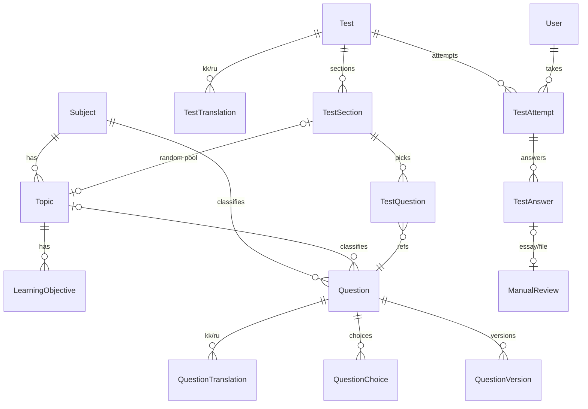
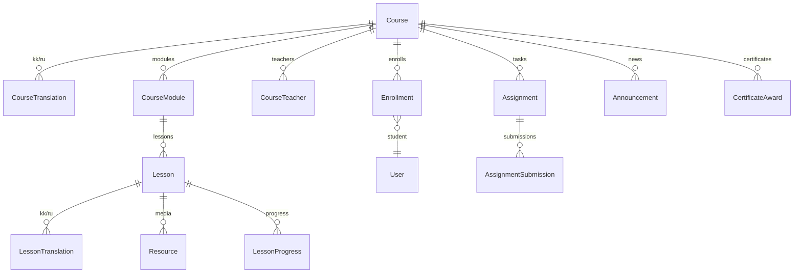
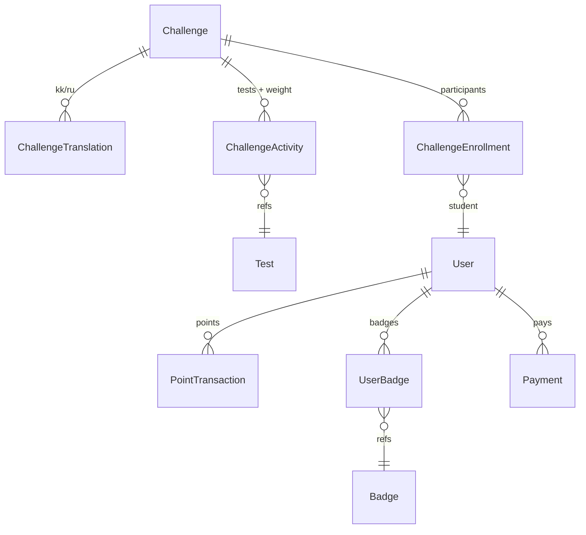

# Модель данных

~60 моделей Prisma (см. [prisma/schema.prisma](../prisma/schema.prisma)) —
источник истины. Все содержательные сущности принадлежат организации
(multi-tenant-ready, D-012); контентные несут `createdAt/updatedAt`,
`createdById` и мягкое удаление `deletedAt`; переводимый контент — в таблицах
переводов с полем `locale` (kk|ru).

## Кластеры

- **Идентичность**: User, Profile (имя, класс, локаль, opt-out из публичного
  рейтинга), Organization, Role, Permission, RolePermission, Membership,
  StudentParent (связь родитель↔ребёнок), Session (sha256-хэши токенов),
  OtpCode, LoginEvent, RateEvent.
- **Таксономия**: Subject, GradeLevel, Topic, LearningObjective, Cohort,
  CohortMember.
- **LMS**: Course (+CourseTranslation, CourseTeacher), CourseModule,
  Lesson (+LessonTranslation), Resource, Enrollment, LessonProgress,
  Assignment, AssignmentSubmission, GradeItem, Announcement, CourseComment,
  CertificateAward.
- **Тесты**: Question (+QuestionTranslation, QuestionChoice, QuestionVersion,
  QuestionTag), Test (+TestTranslation, TestSection, TestQuestion, TestCohort),
  TestAttempt, TestAnswer, ManualReview.
- **Челленджи/геймификация**: Challenge (+ChallengeTranslation,
  ChallengeActivity, ChallengeEnrollment), PointTransaction (unique
  `idempotencyKey`), Badge, UserBadge.
- **Прочее**: Payment, Notification, AuditLog, FileAsset, Review, SiteSettings.

## ER: ядро тестирования

`TestAttempt.layout` (Json) — снимок раскладки на момент старта: список
`{questionId, points, choiceOrder?, presentOrder?, presentOrderRight?}` —
фиксирует перемешивание и случайные выборки, чтобы попытка была
воспроизводимой и оценивалась ровно по тому, что видел ученик.

## ER: LMS

## ER: челленджи и баллы

## Инварианты

- `PointTransaction.idempotencyKey` уникален — повторное начисление невозможно
  на уровне БД.
- `TestAttempt @@unique(testId,userId,attemptNo)` — нумерация попыток.
- `Payment` меняет статус только PENDING→(PAID|FAILED), PAID→REFUNDED;
  fulfillment выполняется один раз при переходе в PAID.
- Удаление контента — `deletedAt` (архив), физически ничего не удаляется.
