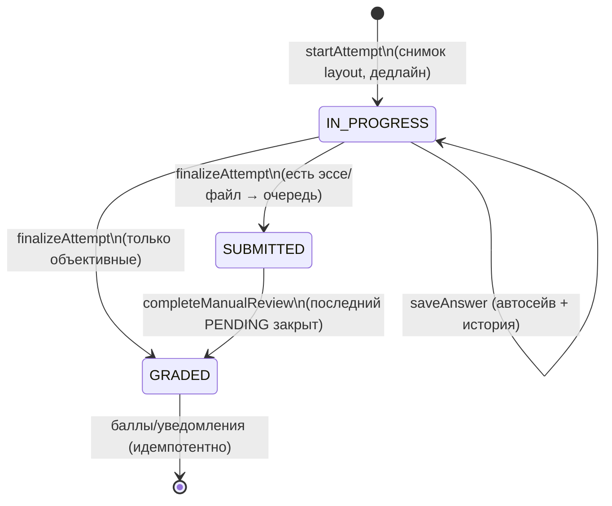

# Движок тестов

Код: [lib/engine/types.ts](../lib/engine/types.ts) (конфиги и форматы ответов,
zod), [grade.ts](../lib/engine/grade.ts) (чистое оценивание),
[attempt.ts](../lib/engine/attempt.ts) (жизненный цикл попытки).

## Жизненный цикл попытки

- **startAttempt**: доступность (статус/окна дат/группы/оплата/код доступа) →
  resume незавершённой попытки → лимит попыток → снимок раскладки: явные
  вопросы секций + случайные выборки из тем; перемешивание вопросов/вариантов
  детерминировано сеется id попытки — раскладка воспроизводима, оценивание
  идёт ровно по тому, что видел ученик. Дедлайн считается на сервере
  (`deadlineAt`), клиент только отображает; grace 10 секунд на сетевые лаги.
- **saveAnswer**: отклоняется после завершения/дедлайна; ответ валидируется
  схемой типа; предыдущее значение уходит в `history` (до 20 записей).
  Клиент шлёт с debounce 600 мс, а при завершении сбрасывает несохранённое
  до POST /finish — быстрый клик «Завершить» не теряет ответ.
- **finalizeAttempt** — идемпотентен: переход выполняется
  `updateMany({where:{id, status:"IN_PROGRESS"}})`; второй вызов ничего не
  меняет и возвращает актуальное состояние. Объективные типы оцениваются сразу;
  на эссе/файлы создаётся `ManualReview` (уникален по answerId).
- **completeManualReview**: оценка обрезается в [0, максимум вопроса]; когда
  закрыт последний PENDING — пересчёт итога, `passed = total/max ≥ passPct`,
  статус GRADED, затем начисление баллов.
- **Баллы** — `awardPoints` с ключом `test:{testId}:user:{userId}`; уникальный
  индекс БД гарантирует ровно одно начисление на тест (повтор → no-op).
  Предпросмотр персонала (`meta.preview`) в аналитику и баллы не попадает.

## Оценивание и частичный балл

| Тип | Правило |
|---|---|
| SINGLE_CHOICE | выбранный = правильный → полный балл |
| MULTI_CHOICE | `proportional`: max(0, верных/всего − лишних/всего) × балл; либо `all_or_nothing` |
| TRUE_FALSE | сравнение с `config.answer` |
| SHORT_TEXT | нормализация (trim, пробелы, регистр по флагу) + списки ответов **обоих языков** |
| NUMERIC | `|ответ − эталон| ≤ tolerance` |
| FILL_BLANKS | по пропускам; `partial` — доля верных |
| MATCHING | канон `l===r`; дубли левых игнорируются; `partial` — доля пар |
| ORDERING | элементы на своём месте; `partial` — доля |
| ESSAY / FILE_UPLOAD | только ручная проверка |

Точность — округление до 2 знаков. Покрытие: `tests/unit/grade.test.ts` (все
типы, граничные случаи), `tests/integration/attempt-engine.test.ts` (полный
цикл, двойной finalize, clamp, идемпотентные баллы, лимит попыток).

## Диагностический режим

`diagnosticsForAttempt` группирует ответы по темам и учебным целям раскладки:
процент по каждой теме, сильные стороны (≥70%), требующие внимания (<50%),
рекомендации материалов. Отдаётся в `/api/attempts/[id]/result` для тестов
режима DIAGNOSTIC и в сводке преподавателя.

## Политики показа результата

`resultsPolicy` (IMMEDIATE / AFTER_CLOSE / MANUAL) и `showCorrect`
(NEVER / AFTER_SUBMIT / AFTER_CLOSE) применяются на сервере при сборке
результата: до разрешённого момента правильные ответы и объяснения в JSON
не попадают вовсе.
